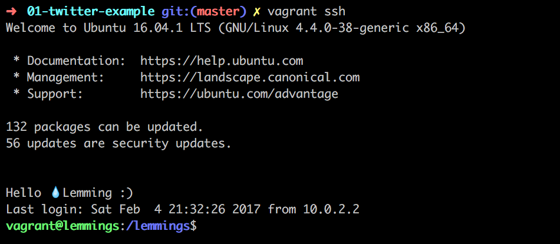
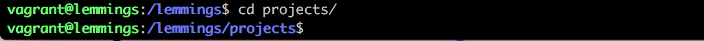
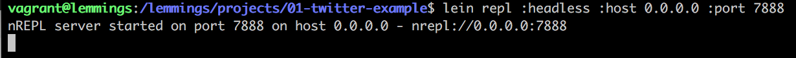
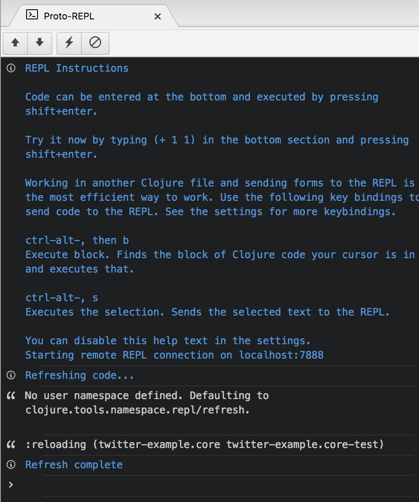
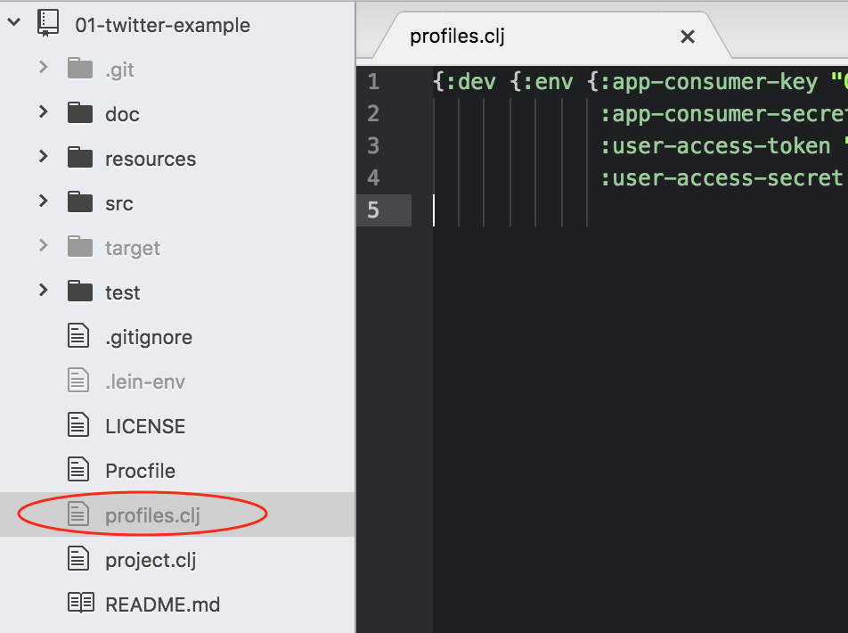
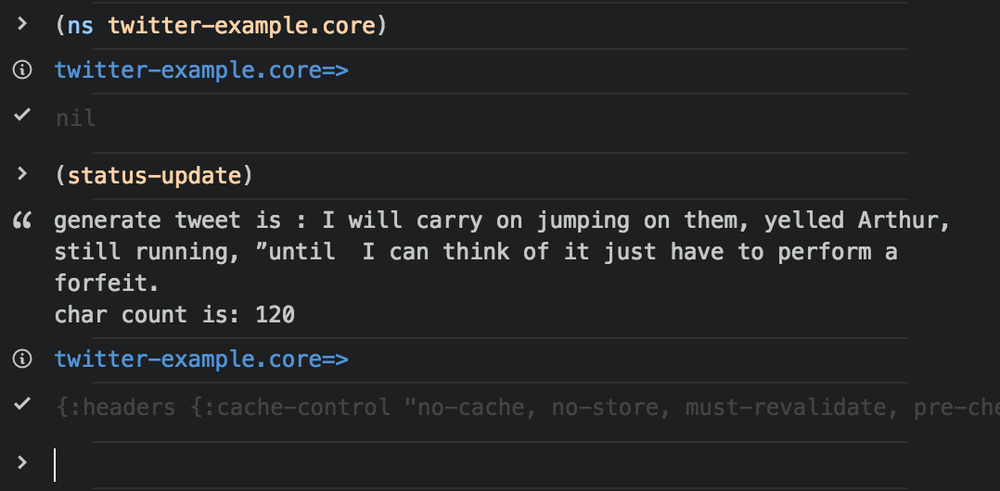
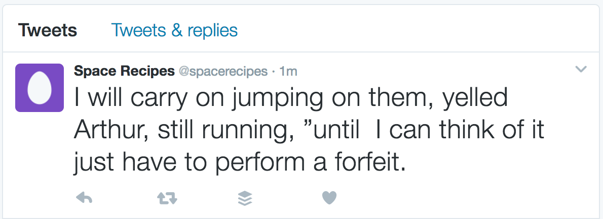

# Twitter Example

A Twitter bot example in Clojure

## Step-by-step Tutorial

1. Make sure you have followed the [Lemmings Clojure and Atom Editor setup](https://lemmings.io/clojure-and-atom-editor-setup-40f8f09237b4).

2. Start a new vagrant session by opening a new terminal window and run `vagrant ssh`.

    

3. In the VM, change into the projects directory with `cd projects/` and start with the tutorial.

    

4. "Clone" the Twitter example into your Vagrant environment

    ```shell
    git clone https://github.com/lemmings-io/01-twitter-example.git
    ```

    Now change into the twitter example directory:

    ```shell
    cd 01-twitter-example
    ```

5. Start the nREPL server

    Start another VM session by opening a new terminal window and run `vagrant ssh`.

    Navigate to the project folder you just created with `cd projects/<your-project-name>`.

    Start the nREPL server with `lein repl :headless :host 0.0.0.0 :port 7888` as described in the [Clojure and Atom Editor Setup](https://lemmings.io/clojure-and-atom-editor-setup-40f8f09237b4)

   

6. Connect to Atom's nREPL.

    Look at the [Lemmings Clojure guide](https://lemmings.io/clojure-and-atom-editor-setup-40f8f09237b4)
    for detailled instructions.

   

7. Turn on the "Autoeval" feature of Proto Repl:

    Open the `core.clj` file in Atom, then open Atom command palette and search
    for "Proto Repl: Autoeval file" and press return.

    This feature will take care to synchronize your code in the `core.clj` file
    with the Clojure REPL.

8. **Artistic Tweaking**

    You can see the lemmings bot in action [here](https://twitter.com/betalemming).

    However, you probably want to personalise your tweets now :)

    In your `core.clj` you'll find two lists: `templates.cls` (the skeleton of your tweets) and `blanks.cls` (the strings you'll fill the blanks with). You can replace these strings with your own, just remember to keep the `___`.

9. Provide your Twitter API tokens for local development by creating a file called `profiles.clj` in `01-twitter-example` with Atom.

    You can find instructions for signing up for Twitter and getting these tokens in the [Twitter Bot example](http://howistart.org/posts/clojure/1/) in the section *Hooking the bot up to Twitter*.

    ```clojure
    {:dev {:env {:app-consumer-key "<REPLACE>"
                 :app-consumer-secret "<REPLACE>"
                 :user-access-token "<REPLACE>"
                 :user-access-secret "<REPLACE>"}}}
    ```
    

4. Test if your bot tweets in Atom's nREPL

    Run `(ns twitter-example.core)` to initialize your app's namespace in the nREPL.

    Then run `(status-update)` in the nREPL to send a status update through your twitter account.

    
    

3. Start the twitter bot inside Vagrant:

    In the Terminal where you are connected to Vagrant (`vagrant ssh`) run `lein trampoline run` to start a Clojure system that will tweet every 2 hours.

## Credit

This example is based on the [Twitter Bot Example in Clojure](http://howistart.org/posts/clojure/1) by [Carin Meier](https://twitter.com/carinmeier).

## License

Copyright © 2017

Distributed under the Eclipse Public License either version 1.0 or (at
your option) any later version.
