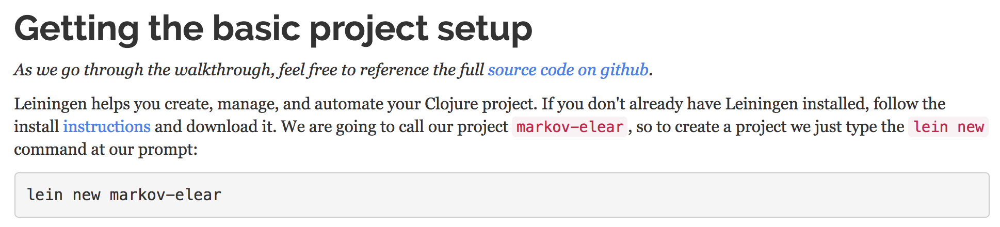
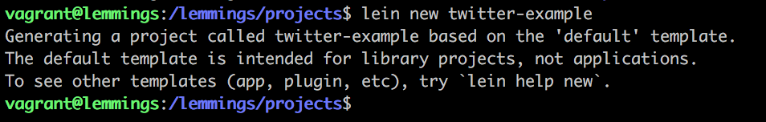

# Twitter Example

A Twitter bot example in Clojure

## Step-by-step Tutorial

1. To get familiar with the programming language Clojure and the development workflow, first off follow the step-by-step tutorial [Twitter Bot Example in Clojure](http://howistart.org/posts/clojure/1). Skip the steps for setting up the Emacs Editor and testing in the tutorial.

2. Start a new vagrant session by opening a new terminal window and run `vagrant ssh`.

  

3. In the VM, change into the projects directory with `cd projects/` and start with the tutorial.

  

4. Running `lein new your-project-name` as described in the section "Getting the basic project setup" of the tutorial will create your clojure app.

  

  

5. Start the nREPL server

  Start another VM session by opening a new terminal window and run `vagrant ssh`.

  Navigate to the project folder you just created with `cd projects/<your-project-name>`.

  Start the nREPL server with `lein repl :headless :host 0.0.0.0 :port 7888` as described in the [Clojure and Atom Editor Setup](https://lemmings.io/clojure-and-atom-editor-setup-40f8f09237b4)

 

6. Connect to Atom's nREPL

 

--

## Fast lane to the first magic tweet

Alternatively to the step-by-step tutorial you can download the finished project here: [lemmings-io/01-twitter-example](https://github.com/lemmings-io/01-twitter-example/archive/master.zip)

1. Extract it into the `/lemmings/clojure/projects` directory.

2. Provide your Twitter API tokens for local development by creating a file called `profiles.clj` in your working directory `<your-project-name>/profiles.clj`.

  ```
  {:dev {:env {:app-consumer-key "<REPLACE>"
               :app-consumer-secret "<REPLACE>"
               :user-access-token "<REPLACE>"
               :user-access-secret "<REPLACE>"}}}
  ```
  

3. Start the twitter bot in the VM

  `lein trampoline run` to start the local server.

4. Test if your bot tweets in Atom's nREPL

  Run `(ns twitter-example.core)` to initialize your app's namespace in the nREPL.

  Then run `(status-update)` in the nREPL to send a status update through your twitter account.

  
  


## Credit

This example is based on the [Twitter Bot Example in Clojure](http://howistart.org/posts/clojure/1) by [Carin Meier](https://twitter.com/carinmeier).

## License

Copyright © 2017

Distributed under the Eclipse Public License either version 1.0 or (at
your option) any later version.
